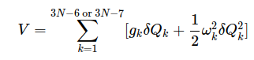

A minimum energy path (MEP) is defined as the steepest-descent path on the potential energy surface from the transition state down towards a local minimum. An IRC path is defined similarly but in the mass-weighted coordinates, which means that instead of the steepest descent direction it follows that of the maximum instantaneous acceleration. This makes IRC somewhat related to the Molecular Dynamics method. The energy profile is obtained as well as the length and curvature properties of the path, providing the basic quantities for an analysis of the reaction path. To construct an Intrinsic reaction path, one proceeds as follows:

### Step 1:

Once a transition state (TS) has been located, its mass-weighted Hessian matrix is formed and diagonalized. The normalized eigenvector s belonging to the one negative eigenvalue of this matrix defines the initial direction(s) leading from the TS to either reactants or products (a unit vector along s is one direction; a unit vector along −s is the second).

### Step 2:

One takes a small step (i.e., a displacement of the Cartesian coordinates {qj} of the nuclei having a total length L ) along the direction s , and this direction is taken to define the first step along the intrinsic reaction coordinate (IRC) that will eventually lead to the IRP. When s is expressed in terms of the its components {sj} along the Cartesian coordinates {qj},
s=∑sjqj

The displacements {δqj} can be expressed as δqj =Lsj

### Step 3:

One re-evaluates the gradient and Hessian at this new geometry (call it {q0}), forms the mass-weighted Hessian at {q0}, and identifies the eigenmode having negative curvature. The gradient along this direction will no longer vanish (as it did at the TS), and the normalized eigenvector of this mode is now used to define the continuation of the direction s along the IRC.

### Step 4:

One then minimizes the energy along the 3N−6 or 3N−7 coordinates transverse to s. This can be done by expressing the energy in terms of the corresponding eigenmodes {Qk} of the mass-weighted Hessian

    

Where gk k is the component of the gradient of the energy along the eigenmode Qk and is the eigenvalue of the mass-weighted Hessian for this mode. This energy minimization transverse to s is designed to constrain the “walk” downhill from the TS at (or near) the minimum in the streambed along which the IRC is evolving. After this energy minimization step, the Cartesian coordinates will be defined as {q1}.

### Step 5:

At {q1}, one re-evaluates the gradient and Hessian, and proceeds as in step (c) above.

This process is continued, generating a series of geometries {q0,q1,q2,…qK} that define points on the IRC. At each of these geometries, the gradient will have its largest component (excluding at the TS, where all components vanish) along the direction of s because the energy minimization process will cause its components transverse to s to (at least approximately) vanish.

### Step 6:

Eventually, a geometry will be reached at which all 3N−5 or 3N−6 of the eigenvalues of the mass-weighted Hessian are positive; here, one is evolving into a region where the curvature along the IRC is positive and suggests one may be approaching a minimum. However, at this point, there will be one eigenmode (the one whose eigenvalue just changed from negative to positive) along which the gradient has its largest component. This eigenmode will continue to define the IRC’s direction s .

### Step 7:

One continues by taking a small step along s downhill in energy, after which the energy is minimized along the modes transverse to s . This process is continued until the magnitude of the gradient (which always points along s) becomes small enough that one can claim to have reached a minimum.

### Step 8:

The process described above will lead from the TS to either the reactants or products, and will define one branch of the IRP. To find the other branch, one returns to step (b) and begins the entire process again but now taking the first small step in the opposite direction (i.e., along the negative of the eigenvector of the mass-weighted Hessian at the TS). Proceeding along this path, one generates the other branch of the IRP; the series of geometries leading from reactants, through the TS, to products defines the full IRP. At any point along this path, the direction s is the direction of the IRC.
